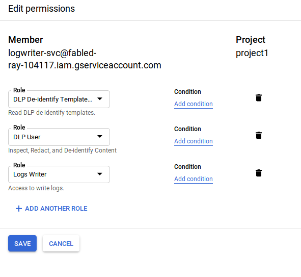
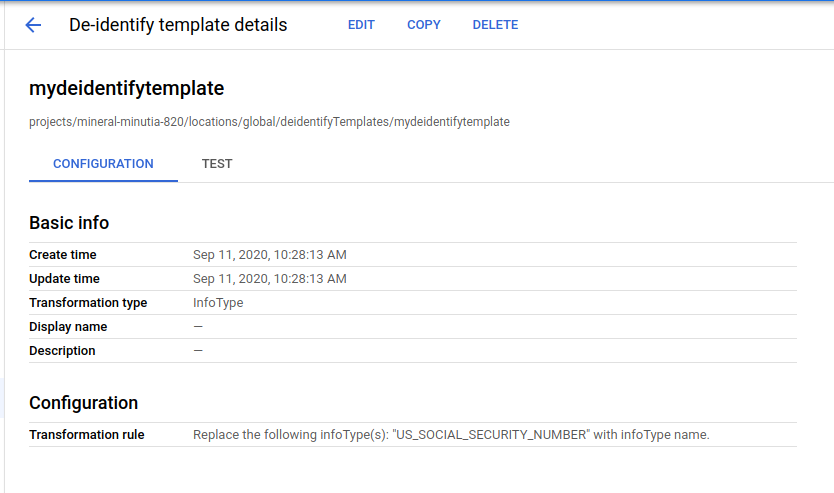
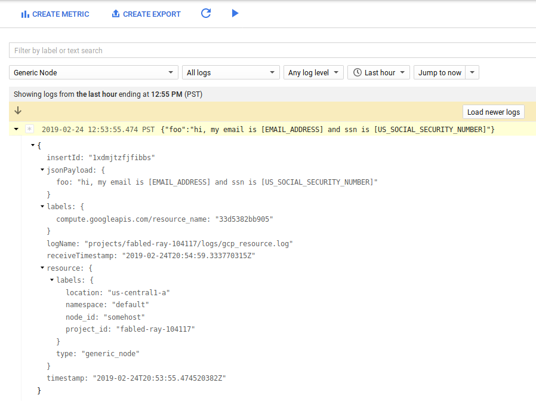
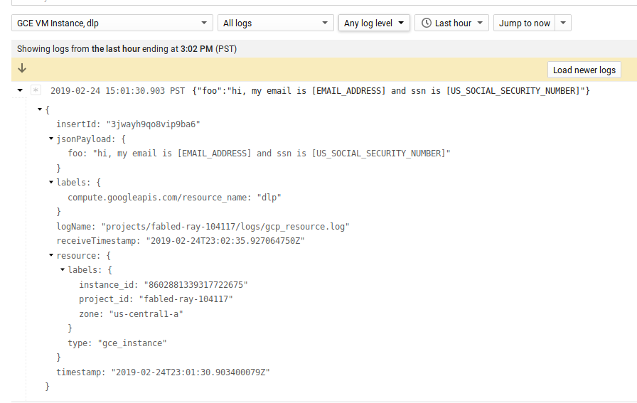
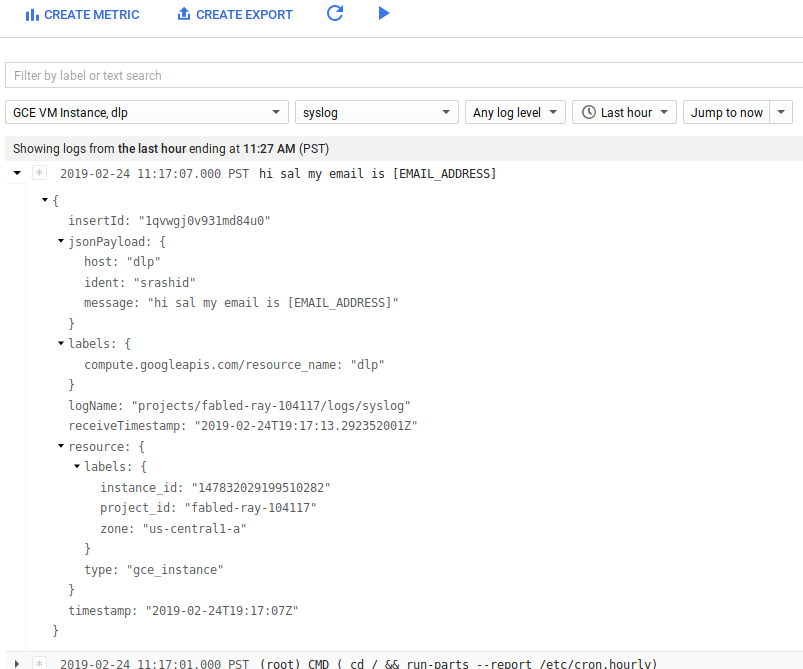

# Fluentd filter plugin for Google Cloud Data Loss Prevention API


Fluentd filter plugin to sanitize logs using GCP [DLP API](https://cloud.google.com/dlp/).  Specifically, this filter reads `fluentd` log records and redacts portiions that the DLP API detects that match the [inputtypes](https://cloud.google.com/dlp/docs/infotypes-reference) configured.

Once the records data is redacted, fluent can forward the sanitized logs to whichever output filter that is configured (in the examples below, the output filter for `Google Cloud Logging` is shown.

>> **NOTE** this plugin (as of 2/25) will only [deIdentify](https://cloud.google.com/dlp/docs/reference/rest/v2/projects.content/deidentify) [string_value](https://github.com/googleapis/googleapis/blob/master/google/privacy/dlp/v2/dlp.proto#L1590) types. 


>> This plugin is **NOT** supported by google

## Plugin configuration

* `deidentify_template, :array, value_type: :string`  --> Reference to DLP [deidentify template](https://cloud.google.com/dlp/docs/creating-templates-deid).
* `use_metadata_service, :bool, :default => false`  --> Use GCE metadata server to derive `access_token` and `project_id` 
* `google_credential_file, :string, :default => nil`  -> Path to GCP json service account credential file.
* `project_id, :string, :default => nil`  --> Set `project_id` manually.  Plugin will attempt to derive project_id from json credential file or GCE metadata.

Installation steps below describes setting this up on 

1) Plain `fluentd` on arbitrary platforms
2) On GCE VM with metadata server and [fluent-plugin-google-cloud]([https://github.com/GoogleCloudPlatform/fluent-plugin-google-cloud) outputs.


>> **NOTE**: 

..some TODOs:
- use [buffered_output](https://docs.fluentd.org/v0.12/articles/buffer-plugin-overview) plugin instead?
- currently only supports [string_value](https://github.com/googleapis/googleapis/blob/master/google/privacy/dlp/v2/dlp.proto#L1590) types
- many others

---

## Installation

### Build gem

Either build `gem` locally or download the one provided in this repo.

- to build locally,
```
gem build fluent-plugin-gcp-dlp-filter.gemspec 
  Successfully built RubyGem
  Name: fluent-plugin-gcp-dlp-filter
  Version: 0.0.8
  File: fluent-plugin-gcp-dlp-filter-0.0.8.gem
```

### Fluentd

This section covers running the dlp agent within a stand-alone docker image.

- Create service account and private key (name the file as `application_default_credential.json`)
- Assign `DLP User`, `DLP De-identify Templates Reader`, and `Logging Writer` IAM roles




Create a DLP template.  The example below uses a de-identify template that replaces an SSN



Copy the service account file to the volume mount in the container 

```bash
mkdir certs
cp application_default_credential.json certs/
cp fluent-plugin-gcp-dlp-filter-0.0.8.gem certs/

docker run -ti  -p 8888:8888 -v `pwd`/certs/:/etc/google/auth/ debian /bin/bash

apt-get update
apt-get install -y curl sudo gnupg make gcc vim procps wget

curl -L https://toolbelt.treasuredata.com/sh/install-debian-stretch-td-agent3.sh | sh

# make sure the credential file is mapped correctly
mkdir -p /etc/google/auth/
chown td-agent:td-agent /etc/google/auth/application_default_credentials.json
chmod go-rwx /etc/google/auth/application_default_credentials.json
          
```

install the dlp gem:

```bash
# install dlp gem
/opt/td-agent/embedded/bin/gem install google-cloud-dlp   
/usr/sbin/td-agent-gem install --local  /etc/google/auth/fluent-plugin-gcp-dlp-filter-0.0.6.gem
```

- edit /etc/td-agent/td-agent.conf 

Specify the URL for the de-identify template and id you created earlier

```bash

<filter gcp_resource.**>
  @type gcp_dlp
  google_credential_file /etc/google/auth/application_default_credentials.json
  deidentify_template projects/your-project-id/deidentifyTemplates/templateid
</filter>

<filter  gcp_resource.**>
  @type stdout
</filter>
```

> Note: please see the followign to configure the [deidentify template](https://cloud.google.com/dlp/docs/creating-templates-deid)

- send traffic

```bash

curl -X POST -d 'json={"foo": "hi, my email is sal@domain.com and ssn is 223-22-2222"}' \
  http://localhost:8888/gcp_resource.log
```

Since the configuration above applies the output to `/var/log/td-agent/td-agent.log`, the log files will show:

```
2019-02-24 20:20:32.802290465 +0000 gcp_resource.log: 
   {"foo":"hi, my email is [EMAIL_ADDRESS] and ssn is [US_SOCIAL_SECURITY_NUMBER]"}
```

#### Fluentd with GCP Output

If you want to emit the logs to GCP from arbitrary, on-prem VMs, you can utilize [genric_node](https://cloud.google.com/monitoring/api/resources#tag_generic_node) and `generic_task` `resource_types` on Stackdriver.   At the moment the `google-plugin-google-cloud` agent does not accept processing of this resource type.  The sample provided in the fork below does include the supported code for this (note, this fork is _not_ supported by google).

* [fluent-google-cloud-plugin fork](https://github.com/salrashid123/fluent-plugin-google-cloud/commit/c003f7c5be7d5c8dace61f94ecc60b6c8f9137db) that supports [generic_node](https://cloud.google.com/monitoring/api/resources#tag_generic_node) type.  (As of 2/24, it is even with upstream master)

* For more info on `generic_*` types, see [Writing Developer logs with Google Cloud Logging](https://github.com/salrashid123/fluent-plugin-google-cloud/tree/master/writing_developer_logs_gcp)

```bash
/opt/td-agent/embedded/bin/gem install google-cloud-dlp
/usr/sbin/td-agent-gem install --local  /etc/google/auth/fluent-plugin-gcp-dlp-filter-0.0.7.gem
# google-api-client version pinned due to conflict..fluent-plugin-google-cloud uses older google-api-client-0.23.9
/opt/td-agent/embedded/bin/gem install google-api-client -v 0.28.4
/opt/td-agent/embedded/bin/gem install fluent-plugin-google-cloud


wget https://raw.githubusercontent.com/salrashid123/fluent-plugin-google-cloud/master/lib/fluent/plugin/out_google_cloud.rb .

cp out_google_cloud.rb \
   /opt/td-agent/embedded/lib/ruby/gems/2.4.0/gems/fluent-plugin-google-cloud-0.7.5/lib/fluent/plugin/out_google_cloud.rb

```

- edit /etc/td-agent/td-agent.conf 

add

```bash
<filter gcp_resource.**>
  @type record_transformer
  @log_level debug
  <record>
    "logging.googleapis.com/local_resource_id" "generic_node.us-central1-a.default.somehost"
  </record>
</filter>

<filter gcp_resource.**>
  @type gcp_dlp
  google_credential_file /etc/google/auth/application_default_credentials.json
  deidentify_template projects/your-project-id/deidentifyTemplates/templateId
</filter>

<filter  gcp_resource.**>
  @type stdout
</filter>

<match gcp_resource.**>
  @type google_cloud
  use_metadata_service false
  @log_level debug
</match>

```
(it will take a min or two to show up in GCP logs)




### GCP

You can also run the agent directly on a GCE VM with the `Stackdriver Logging Agent`:

* Create a VM with full `Cloud Platform Scope`
* Assign IAM roles to VM's service account to `DLP User` and `Logging Writer` Roles

Install the agent:

```
curl -sSO "https://dl.google.com/cloudagents/install-logging-agent.sh"

sudo bash install-logging-agent.sh --structured
```

Install `fluent-plugin-gcp-dlp-filter-0.0.7.gem`

```
/opt/google-fluentd/embedded/bin/gem install google-cloud-dlp
wget https://github.com/salrashid123/fluent-plugin-gcp-dlp-filter/raw/master/fluent-plugin-gcp-dlp-filter-0.0.7.gem
/opt/google-fluentd/embedded/bin/gem install --local fluent-plugin-gcp-dlp-filter-0.0.7.gem
```

> Yes, i didn't add this yet to rubygems

Edit
- /etc/google-fluentd/google-fluentd.conf

```bash

<source>
  @type http
  @id input_http
  port 8888
</source>

<filter gcp_resource.**>
  @type gcp_dlp
  deidentify_template projects/your-project=id/deidentifyTemplates/templateid
  use_metadata_service  true 
</filter>

<filter gcp_resource.**>
  @type stdout
</filter>

<match gcp_resource.**>
  @type google_cloud
  use_metadata_service true
  @log_level debug
</match>

```

Send traffic
```
curl -X POST -d 'json={"foo": "hi, my email is sal@domain.com and ssn is 223-22-2222"}' http://localhost:8888/gcp_resource.log
```

verify in `/var/log/google-fluentd/google-fluentd.log`

```
2019-02-24 23:01:30.903400079 +0000 gcp_resource.log: 
    {"foo":"hi, my email is [EMAIL_ADDRESS] and ssn is [US_SOCIAL_SECURITY_NUMBER]","logging.googleapis.com/insertId":"3jwayh9qo8vip9ba6"}
```




#### GCP Syslog

As with any other fluentd config, you can specify which sources to apply the filter against.  For syslog on GCE, the config

```
<filter syslog**>
  @type gcp_dlp
  deidentify_template projects/your-project-id/deidentifyTemplates/templateid
  use_metadata_service  true 
</filter>
```

will apply the plugin to the syslog.  If you emit a log line like

```
logger "hi sal my email is srashid@domain.com"
```

That will show up in GCP logs as:



> Note: the source system will still include the unredacted log line (in this case the `/var/log/syslog` on the VM itself)

### Testing

> Note, current the test cases actually invokes the DLP API (even as test)!

Edit
`test/plugin/test_gcp_dlp.rb` and update all the `CONFIG*` variables to point to an actual GCP certificate file as well as a reference to a deidentify Template on that project.

eg

```
  CONFIG = %[
    info_types ALL_BASIC
    google_credential_file /path/to/your/local/application_default_credentials.json
    use_metadata_service false
  ]
```

```
$ bundle exec ruby test/plugin/test_gcp_dlp.rb
Loaded suite test/plugin/test_gcp_dlp
Started
..
Finished in 1.042686837 seconds.
----------------------------------------------------------------------------------------------------------------------------------------------------------------------------------------------------------------------------------------------
2 tests, 4 assertions, 0 failures, 0 errors, 0 pendings, 0 omissions, 0 notifications
100% passed
----------------------------------------------------------------------------------------------------------------------------------------------------------------------------------------------------------------------------------------------
1.92 tests/s, 3.84 assertions/s
```


### References

* Fluentd

- https://docs.fluentd.org/v0.12/articles/plugin-development#filter-plugins
- https://docs.fluentd.org/v0.12/articles/buffer-plugin-overview
- https://docs.fluentd.org/v0.12/articles/filter_grep
- https://docs.fluentd.org/v0.12/articles/plugin-development#writing-time-sliced-output-plugins
- https://docs.fluentd.org/v0.12/articles/config-file#note-on-match-order
- https://docs.fluentd.org/v0.12/articles/out_copy

* DLP

- https://cloud.google.com/dlp/docs/redacting-sensitive-data
- https://cloud.google.com/dlp/docs/reference/rest/v2/projects.content/deidentify
- https://github.com/googleapis/googleapis/blob/master/google/privacy/dlp/v2/dlp.proto
